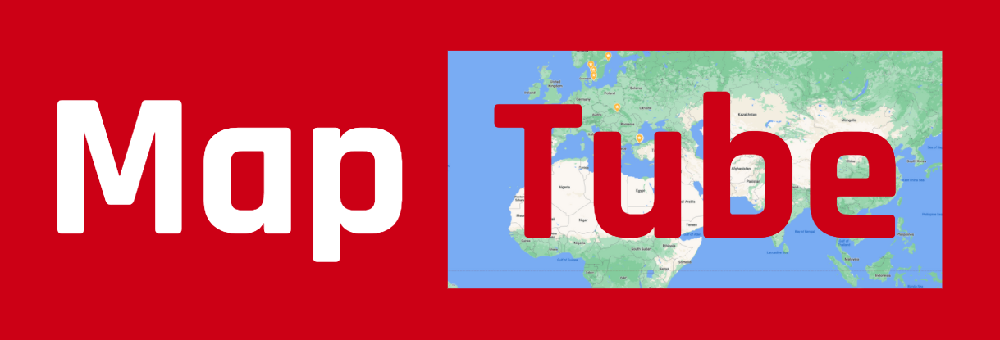
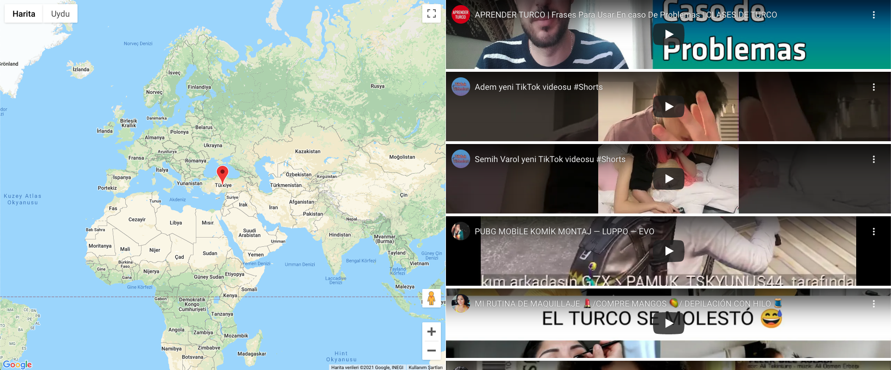

# 

MapTube is a web application that lists videos by location.

This project was created with [Create React App](https://github.com/facebook/create-react-app).

---

## Quick Start

### `Get Google API_KEY`

In order to use YouTube Data API and Maps Javascript API you should enable them and generate an API key.
For more information: https://console.cloud.google.com/

Once you have the API key, place it in `.env` file where you see `[YOUR_API_KEY]` and remove `#` sign in the row.

### `npm install`

Install dependencies.

### `npm start`

Runs the app in the development mode.\
Open [http://localhost:3000](http://localhost:3000) to view it in the browser.

The page will reload if you make edits.\
You will also see any lint errors in the console.

---

## Libraries used in the app

- [react-google-maps](https://www.npmjs.com/package/react-google-maps)
- [react-youtube](https://www.npmjs.com/package/react-youtube)
- [react-infinite-scroll-component](https://www.npmjs.com/package/react-infinite-scroll-component)
